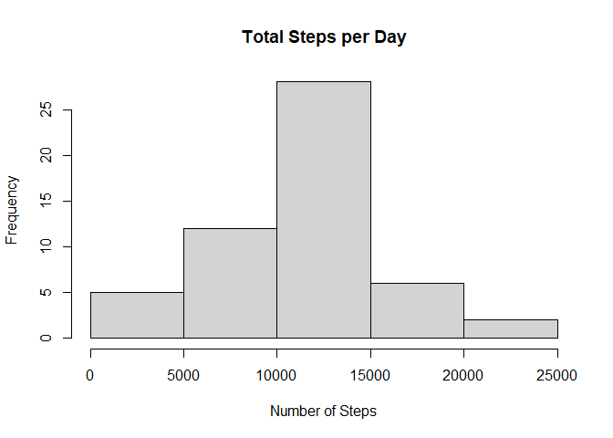
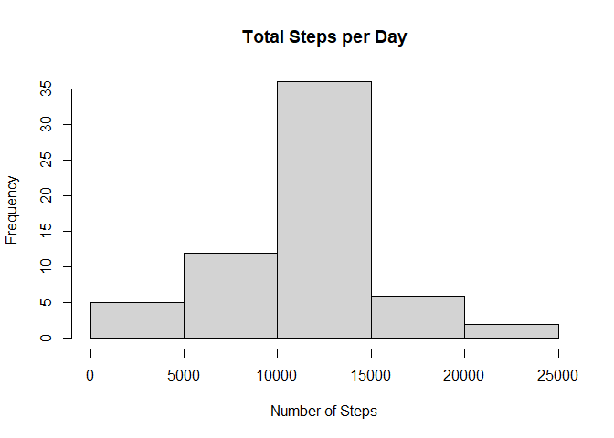

This document contents the next items to be evaluated:

1.  Code for reading in the dataset and/or processing the data
2.  Histogram of the total number of steps taken each day
3.  Mean and median number of steps taken each day
4.  Time series plot of the average number of steps taken
5.  The 5-minute interval that, on average, contains the maximum number
    of steps
6.  Code to describe and show a strategy for imputing missing data
7.  Histogram of the total number of steps taken each day after missing
    values are imputed
8.  Panel plot comparing the average number of steps taken per 5-minute
    interval across weekdays and weekends
9.  All of the R code needed to reproduce the results (numbers, plots,
    etc.) in the report

Loading the libraries to handle the data

    library(dplyr)

    ## Warning: package 'dplyr' was built under R version 4.0.3

    ## 
    ## Attaching package: 'dplyr'

    ## The following objects are masked from 'package:stats':
    ## 
    ##     filter, lag

    ## The following objects are masked from 'package:base':
    ## 
    ##     intersect, setdiff, setequal, union

    library(ggplot2)

    ## Warning: package 'ggplot2' was built under R version 4.0.3

1.  Loading and preprocessing the data

        activity<- read.csv("activity.csv", header = T)

2.  What is mean total number of steps taken per day?

        activity1<- activity %>%
          group_by(date) %>%
          summarise(TSteps = sum(steps))

        ## `summarise()` ungrouping output (override with `.groups` argument)

        hist(activity1$TSteps,
             main = "Total Steps per Day",
             xlab = "Number of Steps")

    

3.  Calculate and report the mean and median of the total number of
    steps taken per day.

        activity2<- activity %>%
          group_by(date) %>%
          summarise(Mean = mean(steps, na.rm=T),
                    Median = median(steps, na.rm = T))%>%
          print()

        ## `summarise()` ungrouping output (override with `.groups` argument)

        ## # A tibble: 61 x 3
        ##    date          Mean Median
        ##    <chr>        <dbl>  <dbl>
        ##  1 2012-10-01 NaN         NA
        ##  2 2012-10-02   0.438      0
        ##  3 2012-10-03  39.4        0
        ##  4 2012-10-04  42.1        0
        ##  5 2012-10-05  46.2        0
        ##  6 2012-10-06  53.5        0
        ##  7 2012-10-07  38.2        0
        ##  8 2012-10-08 NaN         NA
        ##  9 2012-10-09  44.5        0
        ## 10 2012-10-10  34.4        0
        ## # ... with 51 more rows

4.  What is the average daily activity pattern?

        activity3<- activity %>%
          group_by(interval) %>%
          summarise(Mean = mean(steps, na.rm = TRUE))

        ## `summarise()` ungrouping output (override with `.groups` argument)

        plot(activity3$interval, activity3$Mean, type="l", xlab="5-minute Interval", ylab="Average Number Steps")

    

5.  Which 5-minute interval, on average across all the days in the
    dataset, contains the maximum number of steps?

        activity3[which.max(activity3$Mean),]

        ## # A tibble: 1 x 2
        ##   interval  Mean
        ##      <int> <dbl>
        ## 1      835  206.

6.  Code to describe and show a strategy for imputing missing data

    This code replaces the missing values for the calculated mean by
    interval obtained in the point 4:

        missingValues <- is.na(activity$steps)
        activity4 <- transform(activity,
                                  steps = ifelse(is.na(activity$steps),
                                                 activity3$Mean[match(activity$interval, 
                                                                            activity3$interval)],
                                                 activity$steps))

7.  Histogram of the total number of steps taken each day after missing
    values are imputed

        activity5<- activity4 %>%
          group_by(date) %>%
          summarise(TSteps = sum(steps))

        ## `summarise()` ungrouping output (override with `.groups` argument)

        hist(activity5$TSteps,
             main = "Total Steps per Day",
             xlab = "Number of Steps")

    

8.  Panel plot comparing the average number of steps taken per 5-minute
    interval across weekdays and weekends

    Factoring the data in weekdays and weekends with the function below:

        Day <- function(date) {
          day <- weekdays(date)
          if (day %in% c('lunes', 'martes', 'miércoles', 'jueves', 'viernes'))
            return ("weekeday")
          else if (day %in% c('sábado', 'domingo'))
            return ("weekend")
          else
            stop ("Invalid Date Format.")
        }

    Applying the function to the data creating a new column “day”:

        activity4$date <- as.Date(activity4$date)
        activity4$day <- sapply(activity4$date, FUN = Day)

    Plotting the 5-minute interval (x-axis) and the average number of
    steps taken, averaged across all weekday days or weekend days
    (y-axis) for the imputing data.

        activity6<- activity4 %>%
          group_by(day, interval) %>%
          summarise(Mean = mean(steps, na.rm = TRUE))

        ## `summarise()` regrouping output by 'day' (override with `.groups` argument)

        ggplot(activity6, aes(interval, Mean)) + 
          geom_line() +
          facet_grid(day ~ .) +
          ggtitle("Average Daily Activity Pattern") +
          xlab("5-minute Interval") +
          ylab("Average Number of Steps") +
          theme(plot.title = element_text(hjust = 0.5))

    
